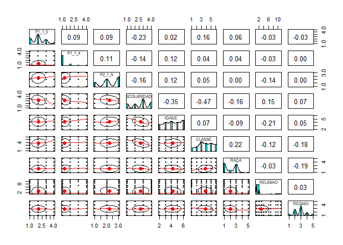

Climate change in the perception of Brazilians: Results of a clusters
analysis
================
Pedro Buril
14/06/2021

Este arquivo reune os primeiros esforços em estudos de agrupamento em
relação a percepção climática dos brasileiros. Neste estudo utilizamos a
técnica de Fuzzy C-Means Clustering, ela se caracteriza por ser uma
técnica de data mining de agrupamento de dados segundo o grau de
semelhança dos casos.

A diferença da técnica é que o mesmo caso pode se comportar de forma
fuzzy e pertencer a mais de um cluster. Realizamos nossas análises em
Open Science (OS), com o intuito de contribuir e sedimentar o
conhecimento sobre as mudanças climáticas no Brasil, bem como guiar
trabalhos futuros de análise de clusters.

Esperamos que este estudo possa contribuir de 3 formas: I) acumule
conhecimento em torno da percepção climática; II) se torne um guia de
análise de agrupamento para os pesquisadores de graduação e
pós-graduação de Ciências Sociais; III) que este se torne um bom
exercício para aqueles que buscam replicar trabalhos acadêmicos.

options(knitr.duplicate.label = “allow”)

## Carregando of dados

## As variáveis selecionadas para o estudo foram:

1.  Sexo;
2.  Região;
3.  Escolaridade;
4.  O quanto você considera que está preocupado (a) com o meio ambiente
    atualmente? Você diria que está…
5.  O quanto você sabe sobre aquecimento global ou mudanças climáticas?
6.  O quanto você acha importante a questão do aquecimento global?

## Selecionando os dados

    ## 
    ##  Shapiro-Wilk normality test
    ## 
    ## data:  banco_selecionado$P1_1_0
    ## W = 0.85631, p-value < 2.2e-16

    ## 
    ##  Shapiro-Wilk normality test
    ## 
    ## data:  banco_selecionado$P1_1_4
    ## W = 0.47017, p-value < 2.2e-16

    ## 
    ##  Shapiro-Wilk normality test
    ## 
    ## data:  banco_selecionado$P2_1_9
    ## W = 0.88875, p-value < 2.2e-16

    ## 
    ##  Shapiro-Wilk normality test
    ## 
    ## data:  banco_selecionado$ESCOLARIDADE
    ## W = 0.85551, p-value < 2.2e-16

    ## 
    ##  Shapiro-Wilk normality test
    ## 
    ## data:  banco_selecionado$SEXO
    ## W = 0.63478, p-value < 2.2e-16

    ## 
    ##  Shapiro-Wilk normality test
    ## 
    ## data:  banco_selecionado$RELIGIAO
    ## W = 0.59545, p-value < 2.2e-16

    ## 
    ##  Shapiro-Wilk normality test
    ## 
    ## data:  banco_selecionado$CLASSE
    ## W = 0.9182, p-value < 2.2e-16

    ## 
    ##  Shapiro-Wilk normality test
    ## 
    ## data:  banco_selecionado$IDADE
    ## W = 0.88238, p-value < 2.2e-16

    ## 
    ##  Shapiro-Wilk normality test
    ## 
    ## data:  banco_selecionado$RAÇA
    ## W = 0.78535, p-value < 2.2e-16

    ## 
    ##  Shapiro-Wilk normality test
    ## 
    ## data:  banco_selecionado$REGIAO
    ## W = 0.89906, p-value < 2.2e-16

<!-- -->

# Clustering Fuzzy C Means (CFM)

(FCM) é um algoritmo soft custering proposto por Bezdek (1974; 1981). Ao
contrário do algoritmo K-means em que cada objeto de dados é membro de
apenas um cluster, um objeto de dados é membro de todos os clusters com
vários graus de associação difusa entre 0 e 1 no FCM. Conseqüentemente,
os objetos de dados mais próximos dos centros dos clusters têm graus de
associação mais elevados do que os objetos espalhados nas bordas dos
clusters.

    ##                   P1_1_0      P1_1_4       P2_1_9 ESCOLARIDADE         SEXO
    ## P1_1_0        1.00000000  0.20067532  0.091585471  -0.25244117  0.042267671
    ## P1_1_4        0.20067532  1.00000000  0.105611541  -0.21389331 -0.078614115
    ## P2_1_9        0.09158547  0.10561154  1.000000000  -0.17283596  0.052997218
    ## ESCOLARIDADE -0.25244117 -0.21389331 -0.172835955   1.00000000  0.037461257
    ## SEXO          0.04226767 -0.07861411  0.052997218   0.03746126  1.000000000
    ## IDADE         0.06589195  0.17870787  0.113493428  -0.39077499  0.019340080
    ## CLASSE        0.18200734  0.08620228  0.098100398  -0.47243116  0.121330248
    ## RAÇA          0.04677145  0.01814439  0.054221038  -0.14599777 -0.039929332
    ## RELIGIAO     -0.05980897 -0.05404596 -0.081713272   0.13946266 -0.051107940
    ## REGIAO       -0.02317881  0.01334357  0.009769908   0.06098054  0.008682127
    ##                    IDADE      CLASSE        RAÇA    RELIGIAO       REGIAO
    ## P1_1_0        0.06589195  0.18200734  0.04677145 -0.05980897 -0.023178812
    ## P1_1_4        0.17870787  0.08620228  0.01814439 -0.05404596  0.013343569
    ## P2_1_9        0.11349343  0.09810040  0.05422104 -0.08171327  0.009769908
    ## ESCOLARIDADE -0.39077499 -0.47243116 -0.14599777  0.13946266  0.060980540
    ## SEXO          0.01934008  0.12133025 -0.03992933 -0.05110794  0.008682127
    ## IDADE         1.00000000  0.10792806 -0.08047627 -0.20447916  0.055709727
    ## CLASSE        0.10792806  1.00000000  0.20558320 -0.11186704 -0.171240287
    ## RAÇA         -0.08047627  0.20558320  1.00000000 -0.01671016 -0.196880013
    ## RELIGIAO     -0.20447916 -0.11186704 -0.01671016  1.00000000  0.023687813
    ## REGIAO        0.05570973 -0.17124029 -0.19688001  0.02368781  1.000000000

<!-- -->

    ##     Cluster 1 Cluster 2  Cluster 3
    ## 1  0.75561507 0.1221105 0.12227447
    ## 2  0.03427767 0.4876822 0.47804016
    ## 3  0.03289360 0.5486719 0.41843451
    ## 4  0.08522803 0.4624518 0.45232022
    ## 5  0.06784305 0.4127023 0.51945468
    ## 6  0.10284886 0.4558097 0.44134148
    ## 7  0.07132452 0.4161958 0.51247971
    ## 8  0.09732740 0.3887145 0.51395806
    ## 9  0.80551062 0.0958073 0.09868208
    ## 10 0.07649846 0.4338317 0.48966982

<!-- -->

    ## 
    ## Call:
    ## lm(formula = clusters ~ P1_1_0 + P2_1_9 + REGIAO + CLASSE + ESCOLARIDADE + 
    ##     IDADE + RAÇA + RELIGIAO, data = cluster.output)
    ## 
    ## Residuals:
    ##      Min       1Q   Median       3Q      Max 
    ## -0.66157 -0.21195  0.02148  0.18407  0.84826 
    ## 
    ## Coefficients:
    ##                 Estimate Std. Error t value Pr(>|t|)    
    ## (Intercept)    2.7698223  0.0455437  60.817  < 2e-16 ***
    ## P1_1_0        -0.0073652  0.0069386  -1.061 0.288594    
    ## P2_1_9        -0.0045365  0.0058237  -0.779 0.436083    
    ## REGIAO2        0.0534831  0.0245985   2.174 0.029797 *  
    ## REGIAO3        0.0618923  0.0238570   2.594 0.009544 ** 
    ## REGIAO4        0.0592722  0.0275669   2.150 0.031658 *  
    ## REGIAO5        0.1075407  0.0307227   3.500 0.000474 ***
    ## CLASSE2        0.0279512  0.0285715   0.978 0.328043    
    ## CLASSE3       -0.0440533  0.0244816  -1.799 0.072090 .  
    ## CLASSE4       -0.2202488  0.0257627  -8.549  < 2e-16 ***
    ## CLASSE5       -0.5162673  0.0262664 -19.655  < 2e-16 ***
    ## CLASSE6       -0.5863755  0.0274976 -21.325  < 2e-16 ***
    ## ESCOLARIDADE2  0.0527644  0.0199579   2.644 0.008259 ** 
    ## ESCOLARIDADE3  0.2385262  0.0196147  12.161  < 2e-16 ***
    ## ESCOLARIDADE4  0.3230423  0.0227349  14.209  < 2e-16 ***
    ## IDADE3        -0.0638220  0.0215040  -2.968 0.003032 ** 
    ## IDADE4        -0.1215316  0.0214579  -5.664 1.68e-08 ***
    ## IDADE5        -0.1994206  0.0226605  -8.800  < 2e-16 ***
    ## IDADE6        -0.2962094  0.0223973 -13.225  < 2e-16 ***
    ## RAÇA2          0.0006468  0.0207749   0.031 0.975166    
    ## RAÇA3         -0.0417747  0.0140399  -2.975 0.002959 ** 
    ## RAÇA4         -0.0879602  0.0364870  -2.411 0.016005 *  
    ## RAÇA5         -0.0801350  0.0439325  -1.824 0.068286 .  
    ## RELIGIAO10    -1.6665498  0.0275942 -60.395  < 2e-16 ***
    ## RELIGIAO11    -1.7248291  0.0298513 -57.781  < 2e-16 ***
    ## RELIGIAO2     -0.0105267  0.0146582  -0.718 0.472747    
    ## RELIGIAO3      0.0087811  0.0497669   0.176 0.859962    
    ## RELIGIAO4      0.0404374  0.0984793   0.411 0.681394    
    ## RELIGIAO5      0.0608225  0.0774891   0.785 0.432591    
    ## RELIGIAO6     -1.6522935  0.0544454 -30.348  < 2e-16 ***
    ## RELIGIAO7     -1.6845872  0.0350351 -48.083  < 2e-16 ***
    ## RELIGIAO8     -2.0671315  0.2775356  -7.448 1.37e-13 ***
    ## RELIGIAO9     -1.6449286  0.0338197 -48.638  < 2e-16 ***
    ## ---
    ## Signif. codes:  0 '***' 0.001 '**' 0.01 '*' 0.05 '.' 0.1 ' ' 1
    ## 
    ## Residual standard error: 0.2762 on 2122 degrees of freedom
    ## Multiple R-squared:  0.8587, Adjusted R-squared:  0.8566 
    ## F-statistic: 402.9 on 32 and 2122 DF,  p-value: < 2.2e-16

    ## 
    ## Call:
    ## lm(formula = clusters ~ P1_1_4 + P2_1_9 + REGIAO + CLASSE + ESCOLARIDADE + 
    ##     IDADE + RAÇA + RELIGIAO, data = cluster.output)
    ## 
    ## Residuals:
    ##     Min      1Q  Median      3Q     Max 
    ## -0.6480 -0.2109  0.0217  0.1825  0.8676 
    ## 
    ## Coefficients:
    ##                Estimate Std. Error t value Pr(>|t|)    
    ## (Intercept)    2.763391   0.044506  62.091  < 2e-16 ***
    ## P1_1_4        -0.006000   0.007212  -0.832 0.405540    
    ## P2_1_9        -0.004516   0.005830  -0.775 0.438636    
    ## REGIAO2        0.052254   0.024591   2.125 0.033706 *  
    ## REGIAO3        0.061632   0.023858   2.583 0.009852 ** 
    ## REGIAO4        0.059212   0.027570   2.148 0.031849 *  
    ## REGIAO5        0.106411   0.030709   3.465 0.000541 ***
    ## CLASSE2        0.025480   0.028541   0.893 0.372092    
    ## CLASSE3       -0.045557   0.024463  -1.862 0.062705 .  
    ## CLASSE4       -0.222039   0.025732  -8.629  < 2e-16 ***
    ## CLASSE5       -0.518399   0.026221 -19.771  < 2e-16 ***
    ## CLASSE6       -0.588606   0.027440 -21.451  < 2e-16 ***
    ## ESCOLARIDADE2  0.052736   0.019991   2.638 0.008402 ** 
    ## ESCOLARIDADE3  0.239110   0.019609  12.194  < 2e-16 ***
    ## ESCOLARIDADE4  0.325164   0.022520  14.439  < 2e-16 ***
    ## IDADE3        -0.064414   0.021497  -2.996 0.002763 ** 
    ## IDADE4        -0.121799   0.021457  -5.676 1.56e-08 ***
    ## IDADE5        -0.198733   0.022665  -8.768  < 2e-16 ***
    ## IDADE6        -0.294630   0.022475 -13.109  < 2e-16 ***
    ## RAÇA2          0.001235   0.020768   0.059 0.952600    
    ## RAÇA3         -0.041486   0.014039  -2.955 0.003161 ** 
    ## RAÇA4         -0.088999   0.036478  -2.440 0.014777 *  
    ## RAÇA5         -0.077629   0.043914  -1.768 0.077248 .  
    ## RELIGIAO10    -1.666433   0.027597 -60.384  < 2e-16 ***
    ## RELIGIAO11    -1.724912   0.029854 -57.778  < 2e-16 ***
    ## RELIGIAO2     -0.010456   0.014660  -0.713 0.475783    
    ## RELIGIAO3      0.009842   0.049798   0.198 0.843350    
    ## RELIGIAO4      0.043009   0.098444   0.437 0.662235    
    ## RELIGIAO5      0.060302   0.077523   0.778 0.436737    
    ## RELIGIAO6     -1.652824   0.054451 -30.354  < 2e-16 ***
    ## RELIGIAO7     -1.682723   0.034984 -48.100  < 2e-16 ***
    ## RELIGIAO8     -2.070741   0.277557  -7.461 1.25e-13 ***
    ## RELIGIAO9     -1.644992   0.033824 -48.634  < 2e-16 ***
    ## ---
    ## Signif. codes:  0 '***' 0.001 '**' 0.01 '*' 0.05 '.' 0.1 ' ' 1
    ## 
    ## Residual standard error: 0.2762 on 2122 degrees of freedom
    ## Multiple R-squared:  0.8587, Adjusted R-squared:  0.8565 
    ## F-statistic: 402.9 on 32 and 2122 DF,  p-value: < 2.2e-16

    ## 
    ## Call:
    ## glm(formula = clusters ~ P1_1_0 + P1_1_4 + P2_1_9 + REGIAO + 
    ##     CLASSE + ESCOLARIDADE + IDADE + RAÇA + RELIGIAO, family = "poisson", 
    ##     data = cluster.output)
    ## 
    ## Deviance Residuals: 
    ##      Min        1Q    Median        3Q       Max  
    ## -0.41547  -0.10988   0.00263   0.10304   0.42073  
    ## 
    ## Coefficients:
    ##                Estimate Std. Error z value Pr(>|z|)    
    ## (Intercept)    1.036112   0.111827   9.265  < 2e-16 ***
    ## P1_1_0        -0.004908   0.017276  -0.284 0.776332    
    ## P1_1_4        -0.002295   0.018197  -0.126 0.899629    
    ## P2_1_9        -0.004771   0.014308  -0.333 0.738798    
    ## REGIAO2        0.019099   0.060052   0.318 0.750448    
    ## REGIAO3        0.023392   0.058004   0.403 0.686739    
    ## REGIAO4        0.023127   0.066689   0.347 0.728754    
    ## REGIAO5        0.038230   0.073807   0.518 0.604474    
    ## CLASSE2        0.015189   0.065782   0.231 0.817388    
    ## CLASSE3       -0.018858   0.056250  -0.335 0.737433    
    ## CLASSE4       -0.094749   0.059823  -1.584 0.113231    
    ## CLASSE5       -0.227351   0.062164  -3.657 0.000255 ***
    ## CLASSE6       -0.265928   0.066134  -4.021 5.79e-05 ***
    ## ESCOLARIDADE2  0.026414   0.051157   0.516 0.605621    
    ## ESCOLARIDADE3  0.110088   0.049451   2.226 0.026000 *  
    ## ESCOLARIDADE4  0.142225   0.056083   2.536 0.011214 *  
    ## IDADE3        -0.029190   0.051244  -0.570 0.568927    
    ## IDADE4        -0.053579   0.051284  -1.045 0.296142    
    ## IDADE5        -0.086277   0.054231  -1.591 0.111628    
    ## IDADE6        -0.127393   0.054065  -2.356 0.018459 *  
    ## RAÇA2          0.003158   0.051154   0.062 0.950779    
    ## RAÇA3         -0.019149   0.033810  -0.566 0.571133    
    ## RAÇA4         -0.040233   0.093799  -0.429 0.667975    
    ## RAÇA5         -0.040203   0.113971  -0.353 0.724279    
    ## RELIGIAO10    -0.988373   0.096518 -10.240  < 2e-16 ***
    ## RELIGIAO11    -1.012723   0.103729  -9.763  < 2e-16 ***
    ## RELIGIAO2     -0.001887   0.033843  -0.056 0.955529    
    ## RELIGIAO3      0.005555   0.112119   0.050 0.960487    
    ## RELIGIAO4      0.009623   0.215263   0.045 0.964343    
    ## RELIGIAO5      0.031079   0.176472   0.176 0.860206    
    ## RELIGIAO6     -0.982241   0.194472  -5.051 4.40e-07 ***
    ## RELIGIAO7     -0.995780   0.124087  -8.025 1.02e-15 ***
    ## RELIGIAO8     -1.150886   1.002033  -1.149 0.250741    
    ## RELIGIAO9     -0.976474   0.119742  -8.155 3.50e-16 ***
    ## ---
    ## Signif. codes:  0 '***' 0.001 '**' 0.01 '*' 0.05 '.' 0.1 ' ' 1
    ## 
    ## (Dispersion parameter for poisson family taken to be 1)
    ## 
    ##     Null deviance: 558.406  on 2154  degrees of freedom
    ## Residual deviance:  53.403  on 2121  degrees of freedom
    ## AIC: 5856
    ## 
    ## Number of Fisher Scoring iterations: 4

    ## 
    ## Call:
    ## glm(formula = clusters ~ P1_1_4 + P2_1_9 + REGIAO + CLASSE + 
    ##     ESCOLARIDADE + IDADE + RAÇA + RELIGIAO, family = "poisson", 
    ##     data = cluster.output)
    ## 
    ## Deviance Residuals: 
    ##      Min        1Q    Median        3Q       Max  
    ## -0.41931  -0.11070   0.00231   0.10238   0.42963  
    ## 
    ## Coefficients:
    ##                Estimate Std. Error z value Pr(>|z|)    
    ## (Intercept)    1.027446   0.107604   9.548  < 2e-16 ***
    ## P1_1_4        -0.003119   0.017964  -0.174  0.86218    
    ## P2_1_9        -0.004943   0.014296  -0.346  0.72952    
    ## REGIAO2        0.018386   0.060000   0.306  0.75927    
    ## REGIAO3        0.023145   0.057999   0.399  0.68985    
    ## REGIAO4        0.022855   0.066683   0.343  0.73179    
    ## REGIAO5        0.037247   0.073728   0.505  0.61342    
    ## CLASSE2        0.013882   0.065620   0.212  0.83246    
    ## CLASSE3       -0.019634   0.056183  -0.349  0.72674    
    ## CLASSE4       -0.095847   0.059697  -1.606  0.10837    
    ## CLASSE5       -0.228482   0.062036  -3.683  0.00023 ***
    ## CLASSE6       -0.267229   0.065978  -4.050 5.12e-05 ***
    ## ESCOLARIDADE2  0.027178   0.051086   0.532  0.59472    
    ## ESCOLARIDADE3  0.111459   0.049217   2.265  0.02353 *  
    ## ESCOLARIDADE4  0.144804   0.055346   2.616  0.00889 ** 
    ## IDADE3        -0.029672   0.051215  -0.579  0.56235    
    ## IDADE4        -0.053823   0.051275  -1.050  0.29386    
    ## IDADE5        -0.086017   0.054225  -1.586  0.11267    
    ## IDADE6        -0.127143   0.054057  -2.352  0.01867 *  
    ## RAÇA2          0.003406   0.051144   0.067  0.94691    
    ## RAÇA3         -0.019048   0.033808  -0.563  0.57316    
    ## RAÇA4         -0.040942   0.093768  -0.437  0.66238    
    ## RAÇA5         -0.038910   0.113878  -0.342  0.73259    
    ## RELIGIAO10    -0.988088   0.096512 -10.238  < 2e-16 ***
    ## RELIGIAO11    -1.012782   0.103727  -9.764  < 2e-16 ***
    ## RELIGIAO2     -0.001953   0.033842  -0.058  0.95399    
    ## RELIGIAO3      0.005502   0.112119   0.049  0.96086    
    ## RELIGIAO4      0.011700   0.215138   0.054  0.95663    
    ## RELIGIAO5      0.032081   0.176435   0.182  0.85572    
    ## RELIGIAO6     -0.982320   0.194471  -5.051 4.39e-07 ***
    ## RELIGIAO7     -0.994395   0.123992  -8.020 1.06e-15 ***
    ## RELIGIAO8     -1.152719   1.002012  -1.150  0.24998    
    ## RELIGIAO9     -0.976409   0.119742  -8.154 3.51e-16 ***
    ## ---
    ## Signif. codes:  0 '***' 0.001 '**' 0.01 '*' 0.05 '.' 0.1 ' ' 1
    ## 
    ## (Dispersion parameter for poisson family taken to be 1)
    ## 
    ##     Null deviance: 558.406  on 2154  degrees of freedom
    ## Residual deviance:  53.484  on 2122  degrees of freedom
    ## AIC: 5854.1
    ## 
    ## Number of Fisher Scoring iterations: 4

<!-- -->

    ## 
    ##  Pearson's Chi-squared test
    ## 
    ## data:  cluster.output$P1_1_0 and cluster.output$clusters
    ## X-squared = 111.05, df = 10, p-value < 2.2e-16

    ## 
    ##  Pearson's Chi-squared test
    ## 
    ## data:  cluster.output$SEXO and cluster.output$clusters
    ## X-squared = 11.903, df = 2, p-value = 0.002602

    ## 
    ##  Pearson's Chi-squared test
    ## 
    ## data:  cluster.output$ESCOLARIDADE and cluster.output$clusters
    ## X-squared = 845.61, df = 6, p-value < 2.2e-16

    ## 
    ##  Pearson's Chi-squared test
    ## 
    ## data:  cluster.output$RELIGIAO and cluster.output$clusters
    ## X-squared = 2161.8, df = 20, p-value < 2.2e-16

    ## 
    ##  Pearson's Chi-squared test
    ## 
    ## data:  cluster.output$P2_1_9 and cluster.output$clusters
    ## X-squared = 101.62, df = 8, p-value < 2.2e-16

    ## 
    ##  Pearson's Chi-squared test
    ## 
    ## data:  cluster.output$P1_1_4 and cluster.output$clusters
    ## X-squared = 69.225, df = 10, p-value = 6.257e-11

    ## 
    ##  Pearson's Chi-squared test
    ## 
    ## data:  cluster.output$CLASSE and cluster.output$clusters
    ## X-squared = 1050.1, df = 10, p-value < 2.2e-16

    ## 
    ##  Pearson's Chi-squared test
    ## 
    ## data:  cluster.output$RAÇA and cluster.output$clusters
    ## X-squared = 85.945, df = 8, p-value = 3.086e-15

    ## 
    ##  Pearson's Chi-squared test
    ## 
    ## data:  cluster.output$REGIAO and cluster.output$clusters
    ## X-squared = 72.706, df = 8, p-value = 1.418e-12

### Matrizes protótipos de cluster inicial e final

No cluster fuzzy, uma etapa de inicialização é necessária para construir
a matriz inicial de protótipos de cluster e a matriz de graus de
filiação. Embora essa tarefa seja geralmente realizada na etapa de
inicialização doagrupamento, os protótipos iniciais e associações também
podem ser inseridos diretamente pelo analista.

    ##           P1_1_0 P1_1_4 P2_1_9 ESCOLARIDADE SEXO IDADE CLASSE RAÇA RELIGIAO
    ## Cluster 1      1      1      3            3    1     6      3    1        3
    ## Cluster 2      2      2      3            3    1     4      4    2        2
    ## Cluster 3      2      1      3            4    2     2      3    1        1
    ##           REGIAO
    ## Cluster 1      3
    ## Cluster 2      3
    ## Cluster 3      5

    ##             P1_1_0   P1_1_4   P2_1_9 ESCOLARIDADE     SEXO    IDADE   CLASSE
    ## Cluster 1 1.972656 1.225811 2.276352     3.016004 1.474003 3.618615 3.454263
    ## Cluster 2 2.146903 1.375536 2.595653     2.418857 1.551985 4.509369 4.226110
    ## Cluster 3 2.081918 1.331892 2.535560     2.719847 1.538936 4.241497 3.775123
    ##               RAÇA RELIGIAO   REGIAO
    ## Cluster 1 1.975057 9.349351 2.932235
    ## Cluster 2 2.158143 1.499621 2.827946
    ## Cluster 3 2.061757 1.498478 2.899123

    ## Summary for 'cluster.results'
    ## 
    ## Number of data objects:  2155 
    ## 
    ## Number of clusters:  3 
    ## 
    ## Crisp clustering vector:
    ##    [1] 1 2 2 2 3 2 3 3 1 3 3 3 3 3 3 3 3 1 3 3 1 2 1 3 2 3 3 3 2 2 2 1 1 1 1 2 3
    ##   [38] 3 3 2 3 3 3 3 3 1 3 1 1 3 1 2 2 2 2 2 2 3 2 3 3 3 3 1 1 1 3 3 3 2 1 3 2 3
    ##   [75] 3 3 1 3 1 1 3 1 1 1 3 2 3 3 2 1 2 3 2 2 3 3 3 1 2 2 2 2 3 2 3 3 3 2 3 1 2
    ##  [112] 3 3 3 3 3 3 2 3 3 3 3 2 3 1 3 3 3 1 3 1 2 3 3 3 2 3 3 3 3 3 2 2 3 2 1 1 3
    ##  [149] 3 1 3 2 2 3 3 3 1 2 1 2 3 2 1 1 3 3 3 3 3 2 3 3 3 1 2 3 2 2 2 2 1 3 3 3 3
    ##  [186] 1 1 3 2 3 2 3 1 2 3 2 2 3 3 2 3 2 2 2 3 3 3 3 3 2 3 3 3 1 3 3 2 3 2 3 2 2
    ##  [223] 3 1 3 2 3 3 3 3 3 3 3 3 3 1 3 3 3 3 1 1 3 2 3 3 3 3 3 2 1 3 1 3 2 2 2 1 3
    ##  [260] 1 3 3 2 3 1 3 3 3 3 2 1 2 3 3 3 1 3 3 2 3 2 3 2 3 1 3 3 3 3 3 2 3 3 3 1 3
    ##  [297] 3 1 2 3 1 3 3 1 3 2 2 2 3 3 2 3 1 2 2 3 2 3 3 2 2 3 3 3 3 2 3 3 3 1 2 3 3
    ##  [334] 3 3 2 3 3 3 3 2 3 3 3 2 3 3 3 3 3 3 2 3 3 3 2 3 3 3 3 3 3 3 2 3 3 3 3 2 3
    ##  [371] 2 2 1 2 3 3 3 3 3 3 3 2 3 3 2 3 2 2 3 3 3 3 1 2 3 2 1 3 2 1 3 3 3 3 3 3 3
    ##  [408] 3 3 1 3 3 3 2 2 2 1 3 3 2 3 2 2 3 2 1 3 3 1 3 2 3 1 2 3 3 3 1 3 2 3 2 1 3
    ##  [445] 3 3 3 2 3 2 2 3 1 3 3 3 3 2 3 1 2 3 2 3 3 2 2 2 2 3 3 2 2 3 3 1 1 2 2 3 3
    ##  [482] 2 3 1 2 2 1 2 3 2 3 3 3 2 2 3 2 2 2 2 3 3 3 1 2 3 3 2 3 1 1 3 3 3 1 2 3 2
    ##  [519] 2 3 2 2 2 2 3 2 2 2 3 3 3 1 2 3 1 1 2 3 1 2 3 1 1 3 2 2 3 3 2 2 3 1 2 2 3
    ##  [556] 2 3 2 3 3 3 3 1 3 2 3 2 2 2 1 2 2 2 2 3 1 3 1 3 3 2 3 2 3 2 3 3 1 2 3 2 3
    ##  [593] 2 2 1 2 3 3 3 3 3 2 1 2 1 2 2 1 1 2 1 3 1 2 3 2 3 1 2 1 3 2 1 3 3 1 3 3 3
    ##  [630] 3 2 1 3 1 2 3 1 3 1 2 1 2 3 3 1 3 2 1 2 3 2 2 3 2 1 2 3 1 3 1 2 2 3 2 3 3
    ##  [667] 3 1 2 2 2 3 1 1 2 1 1 1 3 3 3 1 3 2 3 1 3 2 1 3 2 2 2 2 3 3 2 3 3 3 1 2 3
    ##  [704] 3 3 3 3 3 3 3 2 2 2 2 3 3 1 3 2 2 3 1 2 3 1 2 3 2 3 3 3 3 3 2 3 3 3 3 3 3
    ##  [741] 3 3 3 3 3 3 1 1 3 3 3 3 1 3 3 3 3 3 2 3 2 2 3 3 1 3 3 1 2 2 1 3 3 1 2 3 3
    ##  [778] 3 2 1 2 2 2 2 1 3 1 3 3 2 1 2 2 3 1 3 3 3 3 1 3 1 3 3 1 3 1 3 2 3 2 2 3 1
    ##  [815] 1 3 3 1 3 1 3 1 3 3 2 1 2 2 3 3 3 1 1 2 1 1 1 3 3 2 2 3 3 3 3 2 3 3 1 3 3
    ##  [852] 1 3 3 2 3 2 3 2 3 3 2 2 1 3 2 3 3 3 2 1 3 1 2 2 1 3 3 3 1 2 3 1 2 3 3 3 1
    ##  [889] 1 2 3 2 3 3 2 3 2 3 3 2 3 2 2 2 3 2 1 2 2 1 2 3 3 1 1 3 2 2 1 2 2 3 2 3 3
    ##  [926] 1 1 2 3 2 1 3 2 2 3 3 3 3 2 3 3 2 1 3 2 3 2 1 2 1 2 1 3 3 2 2 1 2 1 3 2 3
    ##  [963] 3 3 3 1 1 3 2 3 1 3 3 3 3 2 3 2 2 2 3 2 3 2 3 3 1 2 3 1 2 1 2 2 3 3 3 1 2
    ## [1000] 2 2 3 3 2 1 3 3 1 1 2 3 2 2 2 3 3 3 2 3 2 2 3 3 2 3 1 2 1 3 3 2 2 2 2 2 2
    ## [1037] 1 3 2 3 2 1 1 2 2 2 2 2 3 2 3 3 1 3 2 2 3 2 3 1 2 3 3 1 2 2 3 3 3 2 3 1 3
    ## [1074] 1 1 3 1 2 2 2 1 1 3 2 1 1 2 2 2 1 3 3 3 2 2 2 3 2 3 2 2 2 2 3 2 1 3 2 3 3
    ## [1111] 1 2 2 3 3 2 2 1 3 3 2 2 3 3 2 2 3 3 3 2 1 2 2 3 2 3 2 2 2 3 2 1 2 3 2 2 3
    ## [1148] 2 1 2 2 2 1 2 2 2 3 2 3 3 1 3 2 2 3 2 2 2 3 2 2 1 3 3 1 3 2 2 3 3 3 3 3 2
    ## [1185] 3 2 3 3 2 3 3 1 3 2 1 2 3 2 1 3 3 2 2 3 3 1 2 2 2 3 3 2 3 3 1 3 3 3 2 3 1
    ## [1222] 3 2 2 2 3 2 3 2 3 2 3 1 1 2 2 3 1 2 1 1 1 3 1 1 2 1 3 2 3 3 2 1 2 3 3 2 2
    ## [1259] 3 1 3 2 3 3 3 2 2 3 2 3 3 1 2 2 3 2 3 1 2 2 3 3 3 1 2 2 2 2 3 1 1 3 2 3 3
    ## [1296] 3 2 3 2 2 1 2 2 3 2 2 3 3 1 3 3 1 1 2 2 2 2 3 2 2 2 3 1 1 2 2 2 3 2 1 2 2
    ## [1333] 1 3 1 2 2 3 1 3 2 3 2 3 3 1 1 2 2 1 2 2 2 3 3 3 3 1 3 1 2 2 2 2 1 3 2 3 2
    ## [1370] 3 2 2 3 2 3 3 3 3 3 3 3 1 3 1 3 1 3 2 2 2 2 2 2 2 1 3 2 1 2 3 3 3 3 2 2 2
    ## [1407] 2 3 1 3 3 1 1 3 2 2 3 1 2 2 3 2 1 1 2 2 2 3 3 2 2 2 2 3 1 3 1 1 2 3 1 1 3
    ## [1444] 1 1 2 2 3 3 2 1 2 2 1 2 3 1 3 1 2 3 2 2 2 2 1 1 3 3 3 3 1 1 1 3 3 3 2 2 2
    ## [1481] 2 3 1 2 2 2 2 1 1 3 1 3 2 2 2 1 3 2 3 2 1 2 2 3 2 1 3 3 1 3 2 2 2 2 3 2 3
    ## [1518] 2 1 1 3 1 3 2 2 1 1 2 2 2 3 1 1 3 2 2 3 3 3 3 1 2 3 2 1 2 2 1 2 1 3 2 2 1
    ## [1555] 2 2 2 2 2 2 2 2 3 2 3 2 2 3 3 2 2 2 3 2 1 2 3 2 2 2 2 3 2 2 2 2 1 1 2 2 3
    ## [1592] 2 3 2 3 1 2 3 3 1 3 2 2 2 3 2 2 2 2 2 2 3 2 2 2 2 2 3 1 3 2 3 3 2 2 3 2 2
    ## [1629] 2 2 3 2 2 2 2 2 3 2 2 3 2 3 3 3 2 3 2 1 2 2 3 1 2 2 2 3 3 2 3 2 1 2 2 3 2
    ## [1666] 2 2 2 1 2 1 2 3 3 1 3 2 2 2 3 2 1 3 3 2 2 3 2 1 2 2 1 1 2 2 2 3 3 3 1 2 2
    ## [1703] 2 2 2 3 2 2 1 3 2 2 2 3 1 3 3 2 3 2 1 2 1 2 2 1 1 3 2 2 2 3 2 2 1 3 3 2 2
    ## [1740] 3 1 2 3 2 3 2 3 1 2 2 2 3 3 2 3 3 1 3 1 3 2 2 2 2 2 1 2 3 3 3 2 3 1 3 2 3
    ## [1777] 3 3 3 2 3 3 3 1 1 3 3 1 2 3 3 2 2 2 3 2 3 3 2 2 2 2 3 3 2 2 2 2 2 2 2 2 2
    ## [1814] 2 1 3 3 2 3 2 2 3 2 3 2 1 2 1 1 1 3 2 2 1 3 1 1 2 3 3 2 2 2 3 2 1 2 1 3 3
    ## [1851] 3 2 1 3 1 3 3 3 2 2 2 3 1 3 3 2 3 2 2 1 2 2 2 2 2 3 2 2 2 2 3 1 2 3 3 3 2
    ## [1888] 3 2 2 2 2 2 2 2 2 2 2 2 2 1 2 2 2 1 2 2 2 2 2 2 2 2 3 2 2 3 3 2 2 2 2 2 2
    ## [1925] 3 2 2 2 2 2 2 2 3 1 2 2 2 2 2 3 2 2 2 2 2 2 2 2 2 3 3 2 3 2 2 2 1 3 2 3 2
    ## [1962] 2 2 1 2 1 2 2 2 3 2 2 2 2 2 3 3 2 2 2 2 1 2 2 1 2 3 2 2 2 2 2 2 1 3 2 3 2
    ## [1999] 1 1 2 1 2 1 2 2 2 2 1 3 3 2 2 2 2 2 3 2 2 2 2 1 2 2 2 2 3 2 1 2 2 2 2 2 2
    ## [2036] 1 2 1 2 2 3 2 2 2 1 3 2 2 2 2 2 3 2 2 2 2 2 2 2 2 1 2 1 3 2 2 2 2 2 2 2 2
    ## [2073] 2 2 2 2 2 1 2 2 2 2 3 2 2 2 2 2 2 3 2 3 2 2 3 2 3 3 3 3 1 3 2 3 2 3 3 2 3
    ## [2110] 1 3 3 2 3 2 3 3 2 1 2 1 2 2 3 3 3 1 3 2 3 2 3 3 3 1 2 3 3 2 1 3 3 3 2 1 3
    ## [2147] 3 3 3 2 1 3 3 2 3
    ## 
    ## Initial cluster prototypes:
    ##           P1_1_0 P1_1_4 P2_1_9 ESCOLARIDADE SEXO IDADE CLASSE RAÇA RELIGIAO
    ## Cluster 1      1      1      3            3    1     6      3    1        3
    ## Cluster 2      2      2      3            3    1     4      4    2        2
    ## Cluster 3      2      1      3            4    2     2      3    1        1
    ##           REGIAO
    ## Cluster 1      3
    ## Cluster 2      3
    ## Cluster 3      5
    ## 
    ## Final cluster prototypes:
    ##             P1_1_0   P1_1_4   P2_1_9 ESCOLARIDADE     SEXO    IDADE   CLASSE
    ## Cluster 1 1.972656 1.225811 2.276352     3.016004 1.474003 3.618615 3.454263
    ## Cluster 2 2.146903 1.375536 2.595653     2.418857 1.551985 4.509369 4.226110
    ## Cluster 3 2.081918 1.331892 2.535560     2.719847 1.538936 4.241497 3.775123
    ##               RAÇA RELIGIAO   REGIAO
    ## Cluster 1 1.975057 9.349351 2.932235
    ## Cluster 2 2.158143 1.499621 2.827946
    ## Cluster 3 2.061757 1.498478 2.899123
    ## 
    ## Distance between the final cluster prototypes
    ##            Cluster 1  Cluster 2
    ## Cluster 2 63.5692485           
    ## Cluster 3 62.3180571  0.3900065
    ## 
    ## Difference between the initial and final cluster prototypes
    ##               P1_1_0     P1_1_4     P2_1_9 ESCOLARIDADE       SEXO      IDADE
    ## Cluster 1 0.97265599  0.2258106 -0.7236479   0.01600425  0.4740031 -2.3813852
    ## Cluster 2 0.14690325 -0.6244644 -0.4043474  -0.58114250  0.5519849  0.5093692
    ## Cluster 3 0.08191846  0.3318924 -0.4644400  -1.28015314 -0.4610635  2.2414974
    ##              CLASSE      RAÇA   RELIGIAO      REGIAO
    ## Cluster 1 0.4542629 0.9750574  6.3493506 -0.06776474
    ## Cluster 2 0.2261102 0.1581429 -0.5003795 -0.17205438
    ## Cluster 3 0.7751227 1.0617566  0.4984778 -2.10087739
    ## 
    ## Root Mean Squared Deviations (RMSD): 4.630485 
    ## Mean Absolute Deviation (MAD): 86.04014 
    ## 
    ## Membership degrees matrix (top and bottom 5 rows): 
    ##    Cluster 1 Cluster 2 Cluster 3
    ## 1 0.75561507 0.1221105 0.1222745
    ## 2 0.03427767 0.4876822 0.4780402
    ## 3 0.03289359 0.5486719 0.4184345
    ## 4 0.08522802 0.4624518 0.4523202
    ## 5 0.06784305 0.4127023 0.5194547
    ## ...
    ##       Cluster 1 Cluster 2 Cluster 3
    ## 2151 0.72556025 0.1378410 0.1365987
    ## 2152 0.05664623 0.3989329 0.5444209
    ## 2153 0.04921779 0.4181951 0.5325871
    ## 2154 0.05470662 0.5552547 0.3900387
    ## 2155 0.05375591 0.4384288 0.5078153
    ## 
    ## Descriptive statistics for the membership degrees by clusters
    ##           Size       Min        Q1      Mean    Median        Q3       Max
    ## Cluster 1  379 0.3660548 0.6498415 0.7338505 0.7722017 0.8379611 0.9723229
    ## Cluster 2  891 0.3724594 0.4856956 0.5078110 0.5075894 0.5286490 0.6156706
    ## Cluster 3  885 0.3636099 0.4917927 0.5101053 0.5088145 0.5285353 0.6062462
    ## 
    ## Dunn's Fuzziness Coefficients:
    ## dunn_coeff normalized 
    ##  0.4740983  0.2111474 
    ## 
    ## Within cluster sum of squares by cluster:
    ##        1        2        3 
    ## 4799.061 8074.031 7146.895 
    ## (between_SS / total_SS =  49.73%) 
    ## 
    ## Available components: 
    ##  [1] "u"          "v"          "v0"         "d"          "x"         
    ##  [6] "cluster"    "csize"      "sumsqrs"    "k"          "m"         
    ## [11] "iter"       "best.start" "func.val"   "comp.time"  "inpargs"   
    ## [16] "algorithm"  "call"

## FCM com inicíos múltiplos

O resultado do agrupamento contém algumas resultado que fornecem
informações sobre alguns componentes, como os valores da função, o
número de interações e o tempo de computação obtido com cada início do
algoritmo. O fragmento de código a seguir demonstra essas saídas.

    ## [1] 12055.16

    ## [1] 424

    ## [1] 1

    ## Summary for 'cluster.results'
    ## 
    ## Number of data objects:  2155 
    ## 
    ## Number of clusters:  3 
    ## 
    ## Crisp clustering vector:
    ##    [1] 1 2 2 2 3 2 3 3 1 3 3 3 3 3 3 3 3 1 3 3 1 2 1 3 2 3 3 3 2 2 2 1 1 1 1 2 3
    ##   [38] 3 3 2 3 3 3 3 3 1 3 1 1 3 1 2 2 2 2 2 2 3 2 3 3 3 3 1 1 1 3 3 3 2 1 3 2 3
    ##   [75] 3 3 1 3 1 1 3 1 1 1 3 2 3 3 2 1 2 3 2 2 3 3 3 1 2 2 2 2 3 2 3 3 3 2 3 1 2
    ##  [112] 3 3 3 3 3 3 2 3 3 3 3 2 3 1 3 3 3 1 3 1 2 3 3 3 2 3 3 3 3 3 2 2 3 2 1 1 3
    ##  [149] 3 1 3 2 2 3 3 3 1 2 1 2 3 2 1 1 3 3 3 3 3 2 3 3 3 1 2 3 2 2 2 2 1 3 3 3 3
    ##  [186] 1 1 3 2 3 2 3 1 2 3 2 2 3 3 2 3 2 2 2 3 3 3 3 3 2 3 3 3 1 3 3 2 3 2 3 2 2
    ##  [223] 3 1 3 2 3 3 3 3 3 3 3 3 3 1 3 3 3 3 1 1 3 2 3 3 3 3 3 2 1 3 1 3 2 2 2 1 3
    ##  [260] 1 3 3 2 3 1 3 3 3 3 2 1 2 3 3 3 1 3 3 2 3 2 3 2 3 1 3 3 3 3 3 2 3 3 3 1 3
    ##  [297] 3 1 2 3 1 3 3 1 3 2 2 2 3 3 2 3 1 2 2 3 2 3 3 2 2 3 3 3 3 2 3 3 3 1 2 3 3
    ##  [334] 3 3 2 3 3 3 3 2 3 3 3 2 3 3 3 3 3 3 2 3 3 3 2 3 3 3 3 3 3 3 2 3 3 3 3 2 3
    ##  [371] 2 2 1 2 3 3 3 3 3 3 3 2 3 3 2 3 2 2 3 3 3 3 1 2 3 2 1 3 2 1 3 3 3 3 3 3 3
    ##  [408] 3 3 1 3 3 3 2 2 2 1 3 3 2 3 2 2 3 2 1 3 3 1 3 2 3 1 2 3 3 3 1 3 2 3 2 1 3
    ##  [445] 3 3 3 2 3 2 2 3 1 3 3 3 3 2 3 1 2 3 2 3 3 2 2 2 2 3 3 2 2 3 3 1 1 2 2 3 3
    ##  [482] 2 3 1 2 2 1 2 3 2 3 3 3 2 2 3 2 2 2 2 3 3 3 1 2 3 3 2 3 1 1 3 3 3 1 2 3 2
    ##  [519] 2 3 2 2 2 2 3 2 2 2 3 3 3 1 2 3 1 1 2 3 1 2 3 1 1 3 2 2 3 3 2 2 3 1 2 2 3
    ##  [556] 2 3 2 3 3 3 3 1 3 2 3 2 2 2 1 2 2 2 2 3 1 3 1 3 3 2 3 2 3 2 3 3 1 2 3 2 3
    ##  [593] 2 2 1 2 3 3 3 3 3 2 1 2 1 2 2 1 1 2 1 3 1 2 3 2 3 1 2 1 3 2 1 3 3 1 3 3 3
    ##  [630] 3 2 1 3 1 2 3 1 3 1 2 1 2 3 3 1 3 2 1 2 3 2 2 3 2 1 2 3 1 3 1 2 2 3 2 3 3
    ##  [667] 3 1 2 2 2 3 1 1 2 1 1 1 3 3 3 1 3 2 3 1 3 2 1 3 2 2 2 2 3 3 2 3 3 3 1 2 3
    ##  [704] 3 3 3 3 3 3 3 2 2 2 2 3 3 1 3 2 2 3 1 2 3 1 2 3 2 3 3 3 3 3 2 3 3 3 3 3 3
    ##  [741] 3 3 3 3 3 3 1 1 3 3 3 3 1 3 3 3 3 3 2 3 2 2 3 3 1 3 3 1 2 2 1 3 3 1 2 3 3
    ##  [778] 3 2 1 2 2 2 2 1 3 1 3 3 2 1 2 2 3 1 3 3 3 3 1 3 1 3 3 1 3 1 3 2 3 2 2 3 1
    ##  [815] 1 3 3 1 3 1 3 1 3 3 2 1 2 2 3 3 3 1 1 2 1 1 1 3 3 2 2 3 3 3 3 2 3 3 1 3 3
    ##  [852] 1 3 3 2 3 2 3 2 3 3 2 2 1 3 2 3 3 3 2 1 3 1 2 2 1 3 3 3 1 2 3 1 2 3 3 3 1
    ##  [889] 1 2 3 2 3 3 2 3 2 3 3 2 3 2 2 2 3 2 1 2 2 1 2 3 3 1 1 3 2 2 1 2 2 3 2 3 3
    ##  [926] 1 1 2 3 2 1 3 2 2 3 3 3 3 2 3 3 2 1 3 2 3 2 1 2 1 2 1 3 3 2 2 1 2 1 3 2 3
    ##  [963] 3 3 3 1 1 3 2 3 1 3 3 3 3 2 3 2 2 2 3 2 3 2 3 3 1 2 3 1 2 1 2 2 3 3 3 1 2
    ## [1000] 2 2 3 3 2 1 3 3 1 1 2 3 2 2 2 3 3 3 2 3 2 2 3 3 2 3 1 2 1 3 3 2 2 2 2 2 2
    ## [1037] 1 3 2 3 2 1 1 2 2 2 2 2 3 2 3 3 1 3 2 2 3 2 3 1 2 3 3 1 2 2 3 3 3 2 3 1 3
    ## [1074] 1 1 3 1 2 2 2 1 1 3 2 1 1 2 2 2 1 3 3 3 2 2 2 3 2 3 2 2 2 2 3 2 1 3 2 3 3
    ## [1111] 1 2 2 3 3 2 2 1 3 3 2 2 3 3 2 2 3 3 3 2 1 2 2 3 2 3 2 2 2 3 2 1 2 3 2 2 3
    ## [1148] 2 1 2 2 2 1 2 2 2 3 2 3 3 1 3 2 2 3 2 2 2 3 2 2 1 3 3 1 3 2 2 3 3 3 3 3 2
    ## [1185] 3 2 3 3 2 3 3 1 3 2 1 2 3 2 1 3 3 2 2 3 3 1 2 2 2 3 3 2 3 3 1 3 3 3 2 3 1
    ## [1222] 3 2 2 2 3 2 3 2 3 2 3 1 1 2 2 3 1 2 1 1 1 3 1 1 2 1 3 2 3 3 2 1 2 3 3 2 2
    ## [1259] 3 1 3 2 3 3 3 2 2 3 2 3 3 1 2 2 3 2 3 1 2 2 3 3 3 1 2 2 2 2 3 1 1 3 2 3 3
    ## [1296] 3 2 3 2 2 1 2 2 3 2 2 3 3 1 3 3 1 1 2 2 2 2 3 2 2 2 3 1 1 2 2 2 3 2 1 2 2
    ## [1333] 1 3 1 2 2 3 1 3 2 3 2 3 3 1 1 2 2 1 2 2 2 3 3 3 3 1 3 1 2 2 2 2 1 3 2 3 2
    ## [1370] 3 2 2 3 2 3 3 3 3 3 3 3 1 3 1 3 1 3 2 2 2 2 2 2 2 1 3 2 1 2 3 3 3 3 2 2 2
    ## [1407] 2 3 1 3 3 1 1 3 2 2 3 1 2 2 3 2 1 1 2 2 2 3 3 2 2 2 2 3 1 3 1 1 2 3 1 1 3
    ## [1444] 1 1 2 2 3 3 2 1 2 2 1 2 3 1 3 1 2 3 2 2 2 2 1 1 3 3 3 3 1 1 1 3 3 3 2 2 2
    ## [1481] 2 3 1 2 2 2 2 1 1 3 1 3 2 2 2 1 3 2 3 2 1 2 2 3 2 1 3 3 1 3 2 2 2 2 3 2 3
    ## [1518] 2 1 1 3 1 3 2 2 1 1 2 2 2 3 1 1 3 2 2 3 3 3 3 1 2 3 2 1 2 2 1 2 1 3 2 2 1
    ## [1555] 2 2 2 2 2 2 2 2 3 2 3 2 2 3 3 2 2 2 3 2 1 2 3 2 2 2 2 3 2 2 2 2 1 1 2 2 3
    ## [1592] 2 3 2 3 1 2 3 3 1 3 2 2 2 3 2 2 2 2 2 2 3 2 2 2 2 2 3 1 3 2 3 3 2 2 3 2 2
    ## [1629] 2 2 3 2 2 2 2 2 3 2 2 3 2 3 3 3 2 3 2 1 2 2 3 1 2 2 2 3 3 2 3 2 1 2 2 3 2
    ## [1666] 2 2 2 1 2 1 2 3 3 1 3 2 2 2 3 2 1 3 3 2 2 3 2 1 2 2 1 1 2 2 2 3 3 3 1 2 2
    ## [1703] 2 2 2 3 2 2 1 3 2 2 2 3 1 3 3 2 3 2 1 2 1 2 2 1 1 3 2 2 2 3 2 2 1 3 3 2 2
    ## [1740] 3 1 2 3 2 3 2 3 1 2 2 2 3 3 2 3 3 1 3 1 3 2 2 2 2 2 1 2 3 3 3 2 3 1 3 2 3
    ## [1777] 3 3 3 2 3 3 3 1 1 3 3 1 2 3 3 2 2 2 3 2 3 3 2 2 2 2 3 3 2 2 2 2 2 2 2 2 2
    ## [1814] 2 1 3 3 2 3 2 2 3 2 3 2 1 2 1 1 1 3 2 2 1 3 1 1 2 3 3 2 2 2 3 2 1 2 1 3 3
    ## [1851] 3 2 1 3 1 3 3 3 2 2 2 3 1 3 3 2 3 2 2 1 2 2 2 2 2 3 2 2 2 2 3 1 2 3 3 3 2
    ## [1888] 3 2 2 2 2 2 2 2 2 2 2 2 2 1 2 2 2 1 2 2 2 2 2 2 2 2 3 2 2 3 3 2 2 2 2 2 2
    ## [1925] 3 2 2 2 2 2 2 2 3 1 2 2 2 2 2 3 2 2 2 2 2 2 2 2 2 3 3 2 3 2 2 2 1 3 2 3 2
    ## [1962] 2 2 1 2 1 2 2 2 3 2 2 2 2 2 3 3 2 2 2 2 1 2 2 1 2 3 2 2 2 2 2 2 1 3 2 3 2
    ## [1999] 1 1 2 1 2 1 2 2 2 2 1 3 3 2 2 2 2 2 3 2 2 2 2 1 2 2 2 2 3 2 1 2 2 2 2 2 2
    ## [2036] 1 2 1 2 2 3 2 2 2 1 3 2 2 2 2 2 3 2 2 2 2 2 2 2 2 1 2 1 3 2 2 2 2 2 2 2 2
    ## [2073] 2 2 2 2 2 1 2 2 2 2 3 2 2 2 2 2 2 3 2 3 2 2 3 2 3 3 3 3 1 3 2 3 2 3 3 2 3
    ## [2110] 1 3 3 2 3 2 3 3 2 1 2 1 2 2 3 3 3 1 3 2 3 2 3 3 3 1 2 3 3 2 1 3 3 3 2 1 3
    ## [2147] 3 3 3 2 1 3 3 2 3
    ## 
    ## Initial cluster prototypes:
    ##           P1_1_0 P1_1_4 P2_1_9 ESCOLARIDADE SEXO IDADE CLASSE RAÇA RELIGIAO
    ## Cluster 1      1      1      3            3    1     6      3    1        3
    ## Cluster 2      2      2      3            3    1     4      4    2        2
    ## Cluster 3      2      1      3            4    2     2      3    1        1
    ##           REGIAO
    ## Cluster 1      3
    ## Cluster 2      3
    ## Cluster 3      5
    ## 
    ## Final cluster prototypes:
    ##             P1_1_0   P1_1_4   P2_1_9 ESCOLARIDADE     SEXO    IDADE   CLASSE
    ## Cluster 1 1.972656 1.225811 2.276352     3.016004 1.474003 3.618615 3.454263
    ## Cluster 2 2.146903 1.375536 2.595653     2.418857 1.551985 4.509369 4.226110
    ## Cluster 3 2.081918 1.331892 2.535560     2.719847 1.538936 4.241497 3.775123
    ##               RAÇA RELIGIAO   REGIAO
    ## Cluster 1 1.975057 9.349351 2.932235
    ## Cluster 2 2.158143 1.499621 2.827946
    ## Cluster 3 2.061757 1.498478 2.899123
    ## 
    ## Distance between the final cluster prototypes
    ##            Cluster 1  Cluster 2
    ## Cluster 2 63.5692485           
    ## Cluster 3 62.3180571  0.3900065
    ## 
    ## Difference between the initial and final cluster prototypes
    ##               P1_1_0     P1_1_4     P2_1_9 ESCOLARIDADE       SEXO      IDADE
    ## Cluster 1 0.97265599  0.2258106 -0.7236479   0.01600425  0.4740031 -2.3813852
    ## Cluster 2 0.14690325 -0.6244644 -0.4043474  -0.58114250  0.5519849  0.5093692
    ## Cluster 3 0.08191846  0.3318924 -0.4644400  -1.28015314 -0.4610635  2.2414974
    ##              CLASSE      RAÇA   RELIGIAO      REGIAO
    ## Cluster 1 0.4542629 0.9750574  6.3493506 -0.06776474
    ## Cluster 2 0.2261102 0.1581429 -0.5003795 -0.17205438
    ## Cluster 3 0.7751227 1.0617566  0.4984778 -2.10087739
    ## 
    ## Root Mean Squared Deviations (RMSD): 4.630485 
    ## Mean Absolute Deviation (MAD): 86.04014 
    ## 
    ## Membership degrees matrix (top and bottom 5 rows): 
    ##    Cluster 1 Cluster 2 Cluster 3
    ## 1 0.75561507 0.1221105 0.1222745
    ## 2 0.03427767 0.4876822 0.4780402
    ## 3 0.03289359 0.5486719 0.4184345
    ## 4 0.08522802 0.4624518 0.4523202
    ## 5 0.06784305 0.4127023 0.5194547
    ## ...
    ##       Cluster 1 Cluster 2 Cluster 3
    ## 2151 0.72556025 0.1378410 0.1365987
    ## 2152 0.05664623 0.3989329 0.5444209
    ## 2153 0.04921779 0.4181951 0.5325871
    ## 2154 0.05470662 0.5552547 0.3900387
    ## 2155 0.05375591 0.4384288 0.5078153
    ## 
    ## Descriptive statistics for the membership degrees by clusters
    ##           Size       Min        Q1      Mean    Median        Q3       Max
    ## Cluster 1  379 0.3660548 0.6498415 0.7338505 0.7722017 0.8379611 0.9723229
    ## Cluster 2  891 0.3724594 0.4856956 0.5078110 0.5075894 0.5286490 0.6156706
    ## Cluster 3  885 0.3636099 0.4917927 0.5101053 0.5088145 0.5285353 0.6062462
    ## 
    ## Dunn's Fuzziness Coefficients:
    ## dunn_coeff normalized 
    ##  0.4740983  0.2111474 
    ## 
    ## Within cluster sum of squares by cluster:
    ##        1        2        3 
    ## 4799.061 8074.031 7146.895 
    ## (between_SS / total_SS =  49.73%) 
    ## 
    ## Available components: 
    ##  [1] "u"          "v"          "v0"         "d"          "x"         
    ##  [6] "cluster"    "csize"      "sumsqrs"    "k"          "m"         
    ## [11] "iter"       "best.start" "func.val"   "comp.time"  "inpargs"   
    ## [16] "algorithm"  "call"

Entre os resultados de inícios múltiplos do algoritmo, a melhor solução
é obtida do início fornecendo o valor mínimo da função e armazenada como
o resultado final do agrupamento dos inícios múltiplos do FCM.

### Cluster plot com fviz\_cluster

Existem algumas versões interessantes dos gráficos de cluster que estão
disponíveis em alguns pacotes do R. Um deles é a função fviz\_cluster do
pacote ‘factoextra’ (Kassambara & Mundt, 2017). Para usar esta função
para o resultado de agrupamento fuzzy, primeiro o objeto de agrupamento
fuzzy de ppclust deve ser convertido em objeto kmeans usando o ppclust2
do pacote ‘ppclust’ conforme mostrado na primeira linha do código:

<!-- --><!-- -->

### Cluster plot with clustplot

O usuário também pode usar a função clusplot no pacote ‘cluster’
(Maechler et al, 2017) para traçar os resultados do agrupamento. Para
este propósito, o objeto de agrupamento fuzzy de ppclust deve ser
convertido em objeto “fanny” usando a função ppclust2 do pacote
‘ppclust’, conforme visto no código a seguir.

<!-- -->

### Validação dos resultados do clustering

A validação do processo de cluster é caracterizado por ser uma avaliação
da qualidade do resultado do agrupamento. Para este propósito, vários
índices de validade foram propostos na literatura do tema. Como o
clustering é uma análise de aprendizagem não supervisionada que não usa
nenhuma informação externa, os índices internos são usados para validar
os resultados do clustering. Embora muitos índices internos tenham sido
propostos originalmente para trabalhar com graus de pertinência
produzidos pelo K-means e suas variantes, a maioria desses índices não
pode ser usada para resultados de agrupamento fuzzy.

No ambiente R, Partition Entropy (PE), Partition Coefficient (PC) e
Modified Partition Coefficient (MPC) e Fuzzy Silhouette Index estão
disponíveis no pacote ‘fclust’ (Ferraro & Giordani, 2015) e podem ser
usados da seguinte forma:

    ## [1] "Entropia de Partição:  0.850004035274797"

    ## [1] "Coeficiente de Partição:  0.474098251039009"

    ## [1] "Fuzzy Silhouette Index:  0.579483902810043"

    ## [1] "Coeficiente de Partição Modificado: 0.211147376558513"

O Coeficiente de entropia pode ser interpretada como uma medida da
incerteza sobre o resultado da medição de um experimento. Assim, quanto
mais calibrada for a partição, maior será a entropia resultante. O
Coeficiente de Partição também varia de 0 (completamente fuzzy) a 1 (um
aglomerado bem definido). O coeficiente de partição modificado (MPC) é
uma distância euclidiana média entre os graus de filiação e o centro da
agrupamento fuzzy. Você deve selecionar a partição que maximize essas
estatísticas.

### Referências bibliográficas

<http://each.uspnet.usp.br/sarajane/wp-content/uploads/2015/11/avaliacao_clustering.pdf>

<https://towardsdatascience.com/hierarchical-clustering-on-categorical-data-in-r-a27e578f2995>

<https://rpubs.com/rahulSaha/Fuzzy-CMeansClustering>

<https://cran.r-project.org/web/packages/ppclust/vignettes/fcm.html#31_pairwise_scatter_plots>

<https://www.datanovia.com/en/lessons/determining-the-optimal-number-of-clusters-3-must-know-methods/>

<https://www.datanovia.com/en/blog/cluster-analysis-in-r-simplified-and-enhanced/>

<https://www.scielo.br/j/ciedu/a/tdqtM99VRQwTZY7YyM5RkYF/?lang=pt>
